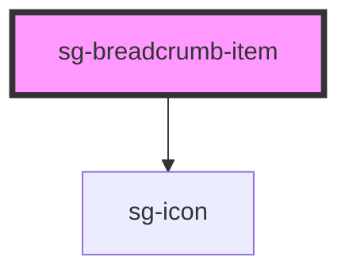

# sg-breadcrumb-item

<!-- Auto Generated Below -->

## Properties

| Property   | Attribute  | Description                             | Type      | Default     |
| ---------- | ---------- | --------------------------------------- | --------- | ----------- |
| `active`   | `active`   | Whether this is the current/active page | `boolean` | `false`     |
| `disabled` | `disabled` | Disable the item                        | `boolean` | `false`     |
| `href`     | `href`     | URL to navigate to                      | `string`  | `undefined` |
| `icon`     | `icon`     | Icon name to display (uses sg-icon)     | `string`  | `undefined` |
| `target`   | `target`   | Target for the link                     | `string`  | `'_self'`   |

## Slots

| Slot     | Description                              |
| -------- | ---------------------------------------- |
|          | Default slot for item content/label      |
| `"icon"` | Optional icon displayed before the label |

## Shadow Parts

| Part          | Description                                |
| ------------- | ------------------------------------------ |
| `"icon"`      | The icon wrapper                           |
| `"item"`      | The list item element                      |
| `"link"`      | The anchor element (when href is provided) |
| `"separator"` | The separator element                      |
| `"text"`      | The text span element (when no href)       |

## Dependencies

### Depends on

- [sg-icon](../../../../icons/src/components/svg-icon)

### Graph

----------------------------------------------

*Built with [StencilJS](https://stenciljs.com/)*
