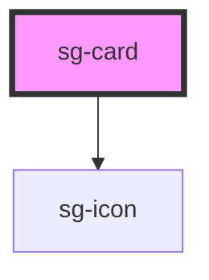

# sg-card

A flexible card component for displaying content in a contained, styled box.

## Features

- Multiple variants: default, primary, success, warning, error, info, gradient, outlined
- Size presets: sm, md, lg
- Optional header with badge
- Icon support
- Action button in footer
- Clickable/hoverable states
- Loading skeleton
- Dark mode support

## Usage

### Basic

```html
<sg-card card-title="Card Title" subtitle="Subtitle text">
  <p>Card content goes here</p>
</sg-card>
```

### With Icon and Variant

```html
<sg-card
  card-title="Users"
  subtitle="Active team members"
  icon="users"
  variant="primary"
  hoverable>
  <p>You have 24 active users in your team.</p>
</sg-card>
```

### With Action Button

```html
<sg-card
  card-title="Subscription"
  subtitle="Pro Plan"
  variant="success"
  action-label="Upgrade Plan">
  <p>Your subscription is active until Dec 2025.</p>
</sg-card>
```

### Clickable Card

```html
<sg-card
  card-title="Dashboard"
  subtitle="View analytics"
  icon="chart"
  clickable
  href="/dashboard">
</sg-card>
```

### With Custom Slots

```html
<sg-card variant="gradient">
  
  <div slot="header">
    <span class="custom-badge">New</span>
  </div>
  <p>Custom content here</p>
  <div slot="footer">
    <sg-button variant="primary">Custom Action</sg-button>
  </div>
</sg-card>
```

## CSS Custom Properties

| Property | Description | Default |
|----------|-------------|---------|
| `--sg-card-bg` | Background color | `#ffffff` |
| `--sg-card-border` | Border color | `#e5e7eb` |
| `--sg-card-radius` | Border radius | `0.75rem` |
| `--sg-card-shadow` | Box shadow | `0 4px 6px...` |
| `--sg-card-padding` | Content padding | `1.25rem` |
| `--sg-card-accent` | Accent color | `#6366f1` |

<!-- Auto Generated Below -->


## Properties

| Property        | Attribute        | Description                                                        | Type                                                                                                | Default     |
| --------------- | ---------------- | ------------------------------------------------------------------ | --------------------------------------------------------------------------------------------------- | ----------- |
| `actionLabel`   | `action-label`   | Label for the action button in footer                              | `string`                                                                                            | `undefined` |
| `actionVariant` | `action-variant` | Variant for the action button                                      | `"ghost" \| "primary" \| "secondary"`                                                               | `'primary'` |
| `cardTitle`     | `card-title`     | Card title displayed in the header                                 | `string`                                                                                            | `undefined` |
| `clickable`     | `clickable`      | Makes the entire card clickable                                    | `boolean`                                                                                           | `false`     |
| `disabled`      | `disabled`       | Disables the card (reduces opacity, no interactions)               | `boolean`                                                                                           | `false`     |
| `flat`          | `flat`           | Removes shadow from the card                                       | `boolean`                                                                                           | `false`     |
| `header`        | `header`         | Optional header text (displays above title with accent background) | `string`                                                                                            | `undefined` |
| `hoverable`     | `hoverable`      | Adds hover elevation effect                                        | `boolean`                                                                                           | `false`     |
| `href`          | `href`           | URL for navigation (makes card a link)                             | `string`                                                                                            | `undefined` |
| `icon`          | `icon`           | Icon name to display (uses sg-icon internally)                     | `string`                                                                                            | `undefined` |
| `iconColor`     | `icon-color`     | Icon color (CSS color value)                                       | `string`                                                                                            | `undefined` |
| `iconSize`      | `icon-size`      | Icon size in pixels                                                | `number \| string`                                                                                  | `48`        |
| `loading`       | `loading`        | Applies loading state with skeleton effect                         | `boolean`                                                                                           | `false`     |
| `size`          | `size`           | Size preset for padding and typography                             | `"lg" \| "md" \| "sm"`                                                                              | `'md'`      |
| `subtitle`      | `subtitle`       | Card subtitle displayed below the title                            | `string`                                                                                            | `undefined` |
| `target`        | `target`         | Target for href link                                               | `string`                                                                                            | `'_self'`   |
| `variant`       | `variant`        | Visual variant of the card                                         | `"default" \| "error" \| "gradient" \| "info" \| "outlined" \| "primary" \| "success" \| "warning"` | `'default'` |


## Events

| Event      | Description                                     | Type                |
| ---------- | ----------------------------------------------- | ------------------- |
| `sgAction` | Emitted when the action button is clicked       | `CustomEvent<void>` |
| `sgClick`  | Emitted when the card is clicked (if clickable) | `CustomEvent<void>` |


## Slots

| Slot       | Description                                              |
| ---------- | -------------------------------------------------------- |
|            | Default slot for card content                            |
| `"footer"` | Optional footer content (overrides action props)         |
| `"header"` | Optional header content (overrides title/subtitle props) |
| `"icon"`   | Custom icon slot                                         |
| `"media"`  | Media content (image/video) displayed at top             |


## Shadow Parts

| Part         | Description              |
| ------------ | ------------------------ |
| `"action"`   | The action button        |
| `"body"`     | The body/content section |
| `"card"`     | The main card container  |
| `"footer"`   | The footer section       |
| `"header"`   | The header section       |
| `"icon"`     | The icon wrapper         |
| `"media"`    | The media container      |
| `"subtitle"` | The subtitle element     |
| `"title"`    | The title element        |


## Dependencies

### Depends on

- [sg-icon](../../../../icons/src/components/svg-icon)

### Graph


----------------------------------------------

*Built with [StencilJS](https://stenciljs.com/)*
