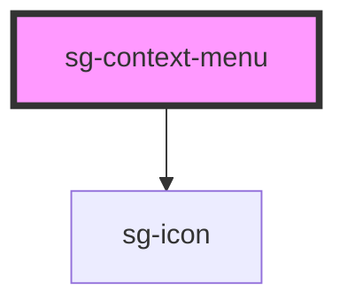

# sg-context-menu

<!-- Auto Generated Below -->

## Properties

| Property | Attribute | Description           | Type                | Default |
| -------- | --------- | --------------------- | ------------------- | ------- |
| `items`  | --        | Menu items to display | `ContextMenuItem[]` | `[]`    |

## Events

| Event       | Description                         | Type                  |
| ----------- | ----------------------------------- | --------------------- |
| `itemClick` | Emitted when a menu item is clicked | `CustomEvent<string>` |
| `menuClose` | Emitted when menu is closed         | `CustomEvent<void>`   |

## Methods

### `close() => Promise<void>`

Close the context menu

#### Returns

Type: `Promise<void>`

### `show(x: number, y: number) => Promise<void>`

Show the context menu at the specified position

#### Parameters

| Name | Type     | Description |
| ---- | -------- | ----------- |
| `x`  | `number` |             |
| `y`  | `number` |             |

#### Returns

Type: `Promise<void>`

## Dependencies

### Depends on

- [sg-icon](../../../../icons/src/components/svg-icon)

### Graph

----------------------------------------------

*Built with [StencilJS](https://stenciljs.com/)*
