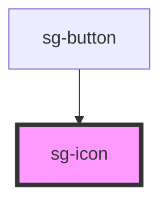

# sg-icon

A flexible, accessible SVG icon component for the SageBox library. Supports built-in icons, custom SVG sources, and dynamic loading from JSON files.

## Features

- 🎨 **Built-in Icons** - Navigation, actions, status, and more
- 📐 **Flexible Sizing** - Numeric pixels or CSS values
- 🎭 **Customizable** - Color, rotation, flip, and spin animations
- ♿ **Accessible** - ARIA support with decorative mode
- 🔌 **Custom Icons** - Load external SVG files via `src` prop
- 📦 **Dynamic Loading** - Load icons from JSON files with `json-src` prop

## Usage

### Basic Usage

```html
<sg-icon name="home"></sg-icon>
```

### Custom Size

```html
<sg-icon name="settings" size="32"></sg-icon>
<sg-icon name="user" size="2rem"></sg-icon>
```

### Custom Color

```html
<sg-icon name="heart" color="#ff0000"></sg-icon>
<sg-icon name="check" color="var(--primary-color)"></sg-icon>
```

### Loading Animation

```html
<sg-icon name="refresh" spin></sg-icon>
```

### Rotation

```html
<sg-icon name="chevron-right" rotate="90"></sg-icon>
<sg-icon name="arrow-up" rotate="180"></sg-icon>
```

### Flip

```html
<sg-icon name="arrow-right" flip-h></sg-icon>
<sg-icon name="arrow-down" flip-v></sg-icon>
```

### Custom SVG Source

```html
<sg-icon src="/assets/icons/custom.svg" size="24"></sg-icon>
```

### Loading Icons from JSON

You can dynamically load icons from a JSON file. This is useful for loading project-specific icons without bundling them in the main package.

```html
<!-- Load icons from a JSON file -->
<sg-icon name="my-icon" json-src="/assets/custom-icons.json"></sg-icon>
```

The JSON file should be an object mapping icon names to SVG strings:

```json
{
  "my-icon": "<svg xmlns=\"http://www.w3.org/2000/svg\" viewBox=\"0 0 24 24\">...</svg>",
  "another-icon": "<svg>...</svg>"
}
```

#### Global Configuration

You can configure a default JSON source for all icons:

```typescript
import { SgIcon } from 'sagebox';

// Configure globally - all <sg-icon> components will use this JSON
SgIcon.configure({ jsonSrc: '/assets/custom-icons.json' });

// Or pre-load icons for better performance
await SgIcon.loadIcons('/assets/custom-icons.json');
```

#### With CLI-generated icons

When using `npx sagebox icons build`, a JSON file is automatically generated alongside the TypeScript file:

```bash
npx sagebox icons build
# Generates:
#   - src/icons/custom-icons.ts (auto-registers icons)
#   - src/icons/custom-icons.json (for dynamic loading)
```

Then you can either:

1. Import the TypeScript file (icons auto-register)
2. Use the JSON file with `json-src` for lazy loading

### Accessibility

```html
<!-- With custom label -->
<sg-icon name="heart" aria-label="Add to favorites"></sg-icon>

<!-- Decorative (hidden from screen readers) -->
<sg-icon name="star" decorative></sg-icon>
```

### In Buttons

```html
<button>
  <sg-icon name="add" size="20"></sg-icon>
  Add New
</button>
```

## Available Icons

### Navigation & UI

`menu`, `close`, `chevron-left`, `chevron-right`, `chevron-up`, `chevron-down`, `arrow-left`, `arrow-right`, `arrow-up`, `arrow-down`, `home`, `settings`, `search`, `more-vert`, `more-horiz`

### Actions

`add`, `remove`, `edit`, `delete`, `save`, `copy`, `download`, `upload`, `share`, `print`, `refresh`, `filter`, `sort`

### Status & Feedback

`check`, `check-circle`, `error`, `warning`, `info`, `help`, `notification`

### User & Account

`user`, `users`, `login`, `logout`

### Content & Media

`image`, `video`, `audio`, `file`, `folder`, `folder-open`, `link`, `attachment`

### Communication

`email`, `chat`, `phone`, `send`

### Medical

`heart`, `heart-pulse`, `medical`, `stethoscope`, `pill`, `hospital`, `calendar`, `clock`

### Visibility

`visibility`, `visibility-off`

### Toggle States

`star`, `star-outline`, `favorite`, `favorite-outline`, `bookmark`, `bookmark-outline`

### Layout

`dashboard`, `grid`, `list`

### Misc

`lock`, `unlock`, `language`, `dark-mode`, `light-mode`, `drag`, `expand`, `collapse`, `fullscreen`, `fullscreen-exit`

## CSS Custom Properties

| Property | Description | Default |
|----------|-------------|---------|
| `--icon-size` | Icon size | `24px` |
| `--icon-width` | Icon width (overrides size) | - |
| `--icon-height` | Icon height (overrides size) | - |
| `--icon-color` | Icon color | `currentColor` |
| `--icon-transform` | Custom transform | `none` |

<!-- Auto Generated Below -->


## Properties

| Property      | Attribute      | Description                                                                                                                                                | Type               | Default          |
| ------------- | -------------- | ---------------------------------------------------------------------------------------------------------------------------------------------------------- | ------------------ | ---------------- |
| `ariaLabel`   | `aria-label`   | Accessible label for screen readers. If not provided, defaults to "{name} icon" for non-decorative icons.                                                  | `string`           | `undefined`      |
| `color`       | `color`        | Color of the icon (CSS color value)                                                                                                                        | `string`           | `'currentColor'` |
| `decorative`  | `decorative`   | Whether the icon is decorative (hidden from screen readers)                                                                                                | `boolean`          | `false`          |
| `fill`        | `fill`         | Alias for color (for compatibility with legacy svg-icon components)                                                                                        | `string`           | `undefined`      |
| `flipH`       | `flip-h`       | Flip the icon horizontally                                                                                                                                 | `boolean`          | `false`          |
| `flipV`       | `flip-v`       | Flip the icon vertically                                                                                                                                   | `boolean`          | `false`          |
| `height`      | `height`       | Height of the icon (overrides size)                                                                                                                        | `number \| string` | `undefined`      |
| `jsonSrc`     | `json-src`     | URL to a JSON file containing icon definitions. The JSON should be an object mapping icon names to SVG strings. Icons are loaded once and cached globally. | `string`           | `undefined`      |
| `name`        | `name`         | The name of the icon from the built-in library. Supports both 'name' and 'icon-name' formats for compatibility.                                            | `string`           | `undefined`      |
| `rotate`      | `rotate`       | Rotation angle in degrees                                                                                                                                  | `number`           | `undefined`      |
| `size`        | `size`         | Size of the icon in pixels                                                                                                                                 | `number \| string` | `24`             |
| `spin`        | `spin`         | Whether the icon should spin (useful for loading icons)                                                                                                    | `boolean`          | `false`          |
| `src`         | `src`          | URL to a custom SVG icon (alternative to name)                                                                                                             | `string`           | `undefined`      |
| `strokeWidth` | `stroke-width` | Stroke width for outline icons                                                                                                                             | `number`           | `undefined`      |
| `width`       | `width`        | Width of the icon (overrides size)                                                                                                                         | `number \| string` | `undefined`      |


## Methods

### `getRegisteredIcons() => Promise<string[]>`

Get list of all registered user icons

#### Returns

Type: `Promise<string[]>`


### `hasIcon(name: string) => Promise<boolean>`

Check if an icon exists (built-in or user-registered)

#### Parameters

| Name   | Type     | Description |
| ------ | -------- | ----------- |
| `name` | `string` |             |

#### Returns

Type: `Promise<boolean>`


### `registerIcon(name: string, icon: IconDefinition | string) => Promise<void>`

Register a single icon

#### Parameters

| Name   | Type                       | Description                    |
| ------ | -------------------------- | ------------------------------ |
| `name` | `string`                   | - Icon name to register        |
| `icon` | `string \| IconDefinition` | - SVG string or IconDefinition |

#### Returns

Type: `Promise<void>`


### `registerIcons(icons: Record<string, IconDefinition | string>) => Promise<void>`

Register multiple icons at once

#### Parameters

| Name    | Type                                         | Description                                                                  |
| ------- | -------------------------------------------- | ---------------------------------------------------------------------------- |
| `icons` | `{ [x: string]: string \| IconDefinition; }` | - Object with icon names as keys and SVG strings or IconDefinition as values |

#### Returns

Type: `Promise<void>`


## Dependencies

### Used by

 - [sg-button](../../../../button/src/components/button)

### Graph


----------------------------------------------

*Built with [StencilJS](https://stenciljs.com/)*
