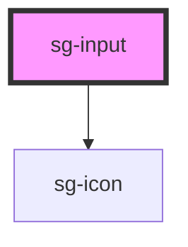

# sg-input

<!-- Auto Generated Below -->

## Properties

| Property            | Attribute            | Description                                                      | Type                                                                                                                            | Default     |
| ------------------- | -------------------- | ---------------------------------------------------------------- | ------------------------------------------------------------------------------------------------------------------------------- | ----------- |
| `autocomplete`      | `autocomplete`       | Autocomplete attribute                                           | `string`                                                                                                                        | `undefined` |
| `autofocus`         | `autofocus`          | Autofocus attribute                                              | `boolean`                                                                                                                       | `false`     |
| `clearable`         | `clearable`          | Show clear button when input has value                           | `boolean`                                                                                                                       | `false`     |
| `disabled`          | `disabled`           | Whether the input is disabled                                    | `boolean`                                                                                                                       | `false`     |
| `errorMessage`      | `error-message`      | Error message (displayed when validation-state is 'error')       | `string`                                                                                                                        | `undefined` |
| `helperText`        | `helper-text`        | Helper text displayed below the input                            | `string`                                                                                                                        | `undefined` |
| `label`             | `label`              | Label text displayed above the input                             | `string`                                                                                                                        | `undefined` |
| `leadingIcon`       | `leading-icon`       | Leading icon name (from sg-icon)                                 | `string`                                                                                                                        | `undefined` |
| `max`               | `max`                | Maximum value for number/date inputs                             | `number \| string`                                                                                                              | `undefined` |
| `maxlength`         | `maxlength`          | Maximum length for text inputs                                   | `number`                                                                                                                        | `undefined` |
| `min`               | `min`                | Minimum value for number/date inputs                             | `number \| string`                                                                                                              | `undefined` |
| `minlength`         | `minlength`          | Minimum length for text inputs                                   | `number`                                                                                                                        | `undefined` |
| `name`              | `name`               | Input name attribute                                             | `string`                                                                                                                        | `undefined` |
| `options`           | `options`            | Options for select type (array of {value, label} or JSON string) | `SelectOption[] \| string`                                                                                                      | `undefined` |
| `pattern`           | `pattern`            | Pattern for validation (regex)                                   | `string`                                                                                                                        | `undefined` |
| `placeholder`       | `placeholder`        | Placeholder text                                                 | `string`                                                                                                                        | `undefined` |
| `readonly`          | `readonly`           | Whether the input is readonly                                    | `boolean`                                                                                                                       | `false`     |
| `required`          | `required`           | Whether the input is required                                    | `boolean`                                                                                                                       | `false`     |
| `selectPlaceholder` | `select-placeholder` | Placeholder option for select (shown when no value selected)     | `string`                                                                                                                        | `undefined` |
| `size`              | `size`               | Input size variant                                               | `"lg" \| "md" \| "sm"`                                                                                                          | `'md'`      |
| `step`              | `step`               | Step value for number inputs                                     | `number \| string`                                                                                                              | `undefined` |
| `trailingIcon`      | `trailing-icon`      | Trailing icon name (from sg-icon)                                | `string`                                                                                                                        | `undefined` |
| `type`              | `type`               | Input type                                                       | `"date" \| "datetime-local" \| "email" \| "number" \| "password" \| "search" \| "select" \| "tel" \| "text" \| "time" \| "url"` | `'text'`    |
| `validationState`   | `validation-state`   | Validation state                                                 | `"default" \| "error" \| "success" \| "warning"`                                                                                | `'default'` |
| `value`             | `value`              | Input value                                                      | `string`                                                                                                                        | `''`        |
| `variant`           | `variant`            | Visual variant                                                   | `"default" \| "filled" \| "outline" \| "underline"`                                                                             | `'default'` |

## Events

| Event      | Description                                           | Type                                                 |
| ---------- | ----------------------------------------------------- | ---------------------------------------------------- |
| `sgBlur`   | Emitted when the input loses focus                    | `CustomEvent<void>`                                  |
| `sgChange` | Emitted when the input loses focus after value change | `CustomEvent<{ value: string; }>`                    |
| `sgClear`  | Emitted when the clear button is clicked              | `CustomEvent<void>`                                  |
| `sgFocus`  | Emitted when the input gains focus                    | `CustomEvent<void>`                                  |
| `sgInput`  | Emitted when the input value changes                  | `CustomEvent<{ value: string; event: InputEvent; }>` |

## Methods

### `clear() => Promise<void>`

Clears the input value

#### Returns

Type: `Promise<void>`

### `getInputElement() => Promise<HTMLInputElement | undefined>`

Returns the native input element

#### Returns

Type: `Promise<HTMLInputElement>`

### `select() => Promise<void>`

Selects all text in the input

#### Returns

Type: `Promise<void>`

### `setBlur() => Promise<void>`

Removes focus from the input

#### Returns

Type: `Promise<void>`

### `setFocus() => Promise<void>`

Sets focus on the input

#### Returns

Type: `Promise<void>`

## Slots

| Slot       | Description                                         |
| ---------- | --------------------------------------------------- |
| `"prefix"` | Content to show before the input (inside the field) |
| `"suffix"` | Content to show after the input (inside the field)  |

## Dependencies

### Depends on

- [sg-icon](../../../../icons/src/components/svg-icon)

### Graph

----------------------------------------------

*Built with [StencilJS](https://stenciljs.com/)*
