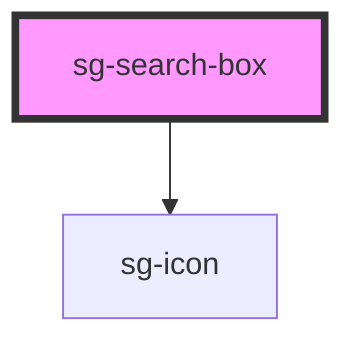

# sg-search-box

<!-- Auto Generated Below -->

## Properties

| Property            | Attribute             | Description                        | Type                   | Default       |
| ------------------- | --------------------- | ---------------------------------- | ---------------------- | ------------- |
| `clearButtonLabel`  | `clear-button-label`  | Label for clear button             | `string`               | `'Limpiar'`   |
| `clearIcon`         | `clear-icon`          | Icon name for clear button         | `string`               | `'delete'`    |
| `disabled`          | `disabled`            | Disable the search box             | `boolean`              | `false`       |
| `hideClearButton`   | `hide-clear-button`   | Hide clear button                  | `boolean`              | `false`       |
| `hideSearchButton`  | `hide-search-button`  | Hide search button                 | `boolean`              | `false`       |
| `placeholder`       | `placeholder`         | Placeholder text for the input     | `string`               | `'Buscar...'` |
| `searchButtonLabel` | `search-button-label` | Label for search button            | `string`               | `'Buscar'`    |
| `searchIcon`        | `search-icon`         | Icon name for search button        | `string`               | `'view'`      |
| `size`              | `size`                | Size variant: 'sm' \| 'md' \| 'lg' | `"lg" \| "md" \| "sm"` | `'md'`        |
| `value`             | `value`               | Current search term value          | `string`               | `''`          |

## Events

| Event      | Description                                              | Type                  |
| ---------- | -------------------------------------------------------- | --------------------- |
| `sgClear`  | Emitted when clear button is clicked                     | `CustomEvent<void>`   |
| `sgInput`  | Emitted when search term changes                         | `CustomEvent<string>` |
| `sgSearch` | Emitted when search is triggered (button click or Enter) | `CustomEvent<string>` |

## Dependencies

### Depends on

- [sg-icon](../../../../icons/src/components/svg-icon)

### Graph

----------------------------------------------

*Built with [StencilJS](https://stenciljs.com/)*
