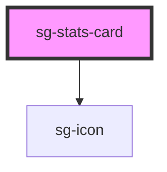

# sg-stats-card

<!-- Auto Generated Below -->

## Properties

| Property         | Attribute         | Description                                              | Type                                                                             | Default     |
| ---------------- | ----------------- | -------------------------------------------------------- | -------------------------------------------------------------------------------- | ----------- |
| `animationDelay` | `animation-delay` | Animation delay in ms (for staggered animations)         | `number`                                                                         | `0`         |
| `cardTitle`      | `card-title`      | Card title/label                                         | `string`                                                                         | `''`        |
| `color`          | `color`           | Color theme                                              | `"cyan" \| "error" \| "info" \| "primary" \| "purple" \| "success" \| "warning"` | `'primary'` |
| `description`    | `description`     | Description text below the value                         | `string`                                                                         | `''`        |
| `icon`           | `icon`            | Icon name (uses sg-icon)                                 | `string`                                                                         | `undefined` |
| `loading`        | `loading`         | Show loading skeleton                                    | `boolean`                                                                        | `false`     |
| `stats`          | `stats`           | Additional stats breakdown (JSON string or array)        | `StatItem[] \| string`                                                           | `undefined` |
| `trend`          | `trend`           | Trend indicator: 'up', 'down', or percentage like '+12%' | `string`                                                                         | `undefined` |
| `trendPositive`  | `trend-positive`  | Whether trend is positive (green) or negative (red)      | `boolean`                                                                        | `true`      |
| `unit`           | `unit`            | Unit suffix for the value                                | `string`                                                                         | `''`        |
| `value`          | `value`           | Main value to display                                    | `number \| string`                                                               | `''`        |

## Slots

| Slot     | Description                            |
| -------- | -------------------------------------- |
|          | Default slot for additional content    |
| `"icon"` | Custom icon slot (overrides icon prop) |

## Shadow Parts

| Part            | Description                   |
| --------------- | ----------------------------- |
| `"card"`        | The main card container       |
| `"description"` | The description text          |
| `"header"`      | The header section with title |
| `"icon"`        | The icon container            |
| `"stats"`       | The additional stats section  |
| `"value"`       | The main value display        |

## Dependencies

### Depends on

- [sg-icon](../../../../icons/src/components/svg-icon)

### Graph

----------------------------------------------

*Built with [StencilJS](https://stenciljs.com/)*
