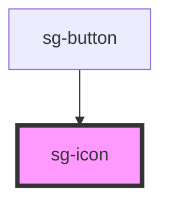

# mq-icon

A flexible, accessible SVG icon component for the MediQ UI library. Supports both built-in icons and custom SVG sources.

## Features

- 🎨 **70+ Built-in Icons** - Navigation, actions, status, medical, and more
- 📐 **Flexible Sizing** - Numeric pixels or CSS values
- 🎭 **Customizable** - Color, rotation, flip, and spin animations
- ♿ **Accessible** - ARIA support with decorative mode
- 🔌 **Custom Icons** - Load external SVG files via `src` prop

## Usage

### Basic Usage

```html
<mq-icon name="home"></mq-icon>
```

### Custom Size

```html
<mq-icon name="settings" size="32"></mq-icon>
<mq-icon name="user" size="2rem"></mq-icon>
```

### Custom Color

```html
<mq-icon name="heart" color="#ff0000"></mq-icon>
<mq-icon name="check" color="var(--primary-color)"></mq-icon>
```

### Loading Animation

```html
<mq-icon name="refresh" spin></mq-icon>
```

### Rotation

```html
<mq-icon name="chevron-right" rotate="90"></mq-icon>
<mq-icon name="arrow-up" rotate="180"></mq-icon>
```

### Flip

```html
<mq-icon name="arrow-right" flip-h></mq-icon>
<mq-icon name="arrow-down" flip-v></mq-icon>
```

### Custom SVG Source

```html
<mq-icon src="/assets/icons/custom.svg" size="24"></mq-icon>
```

### Accessibility

```html
<!-- With custom label -->
<mq-icon name="heart" aria-label="Add to favorites"></mq-icon>

<!-- Decorative (hidden from screen readers) -->
<mq-icon name="star" decorative></mq-icon>
```

### In Buttons

```html
<button>
  <mq-icon name="add" size="20"></mq-icon>
  Add New
</button>
```

## Available Icons

### Navigation & UI
`menu`, `close`, `chevron-left`, `chevron-right`, `chevron-up`, `chevron-down`, `arrow-left`, `arrow-right`, `arrow-up`, `arrow-down`, `home`, `settings`, `search`, `more-vert`, `more-horiz`

### Actions
`add`, `remove`, `edit`, `delete`, `save`, `copy`, `download`, `upload`, `share`, `print`, `refresh`, `filter`, `sort`

### Status & Feedback
`check`, `check-circle`, `error`, `warning`, `info`, `help`, `notification`

### User & Account
`user`, `users`, `login`, `logout`

### Content & Media
`image`, `video`, `audio`, `file`, `folder`, `folder-open`, `link`, `attachment`

### Communication
`email`, `chat`, `phone`, `send`

### Medical (MediQ specific)
`heart`, `heart-pulse`, `medical`, `stethoscope`, `pill`, `hospital`, `calendar`, `clock`

### Visibility
`visibility`, `visibility-off`

### Toggle States
`star`, `star-outline`, `favorite`, `favorite-outline`, `bookmark`, `bookmark-outline`

### Layout
`dashboard`, `grid`, `list`

### Misc
`lock`, `unlock`, `language`, `dark-mode`, `light-mode`, `drag`, `expand`, `collapse`, `fullscreen`, `fullscreen-exit`

## CSS Custom Properties

| Property | Description | Default |
|----------|-------------|---------|
| `--icon-size` | Icon size | `24px` |
| `--icon-width` | Icon width (overrides size) | - |
| `--icon-height` | Icon height (overrides size) | - |
| `--icon-color` | Icon color | `currentColor` |
| `--icon-transform` | Custom transform | `none` |

<!-- Auto Generated Below -->


## Properties

| Property      | Attribute      | Description                                                                                                     | Type               | Default          |
| ------------- | -------------- | --------------------------------------------------------------------------------------------------------------- | ------------------ | ---------------- |
| `ariaLabel`   | `aria-label`   | Accessible label for screen readers                                                                             | `string`           | `undefined`      |
| `color`       | `color`        | Color of the icon (CSS color value)                                                                             | `string`           | `'currentColor'` |
| `decorative`  | `decorative`   | Whether the icon is decorative (hidden from screen readers)                                                     | `boolean`          | `false`          |
| `fill`        | `fill`         | Alias for color (for compatibility with legacy svg-icon components)                                             | `string`           | `undefined`      |
| `flipH`       | `flip-h`       | Flip the icon horizontally                                                                                      | `boolean`          | `false`          |
| `flipV`       | `flip-v`       | Flip the icon vertically                                                                                        | `boolean`          | `false`          |
| `height`      | `height`       | Height of the icon (overrides size)                                                                             | `number \| string` | `undefined`      |
| `name`        | `name`         | The name of the icon from the built-in library. Supports both 'name' and 'icon-name' formats for compatibility. | `string`           | `undefined`      |
| `rotate`      | `rotate`       | Rotation angle in degrees                                                                                       | `number`           | `undefined`      |
| `size`        | `size`         | Size of the icon in pixels                                                                                      | `number \| string` | `24`             |
| `spin`        | `spin`         | Whether the icon should spin (useful for loading icons)                                                         | `boolean`          | `false`          |
| `src`         | `src`          | URL to a custom SVG icon (alternative to name)                                                                  | `string`           | `undefined`      |
| `strokeWidth` | `stroke-width` | Stroke width for outline icons                                                                                  | `number`           | `undefined`      |
| `width`       | `width`        | Width of the icon (overrides size)                                                                              | `number \| string` | `undefined`      |


## Dependencies

### Used by

 - [sg-button](../button)

### Graph


----------------------------------------------

*Built with [StencilJS](https://stenciljs.com/)*
